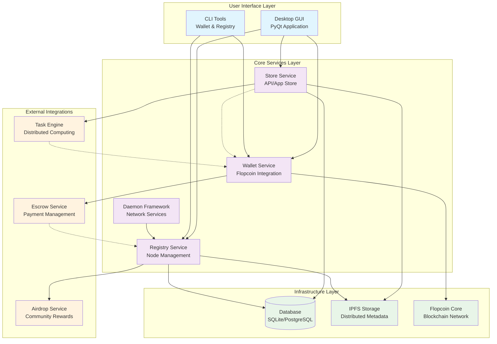

# DuxNet

DuxNet is a modular, decentralized application platform with a Python GUI and CLI, supporting distributed computing, payments, and a decentralized app store. This repository contains the core DuxNet application, including the desktop GUI, wallet, store, daemon, and registry modules.

## 🚀 Quickstart

### **Prerequisites**
- Python 3.8+  
- pip (Python package manager)  
- Flopcoin Core daemon (required for wallet functionality)  
  - Download and run from: https://github.com/flopcoin/flopcoin-core

### **Installation**
```bash
# Clone the repository
git clone https://github.com/ducks-github/DuxNet.git
cd DuxNet

# (Recommended) Create and activate a Python virtual environment
python3 -m venv .venv
source .venv/bin/activate

# Install all Python dependencies
pip install -r requirements.txt
```

### **Configuration**
- **Wallet:** Edit `duxnet_wallet/config.yaml` with your Flopcoin RPC credentials.
- **Store:** Edit `duxnet_store/config.yaml` for store settings.
- **Daemon:** Edit `duxnet_daemon_template/config.yaml` for daemon settings.

### **Running the Application**
- **Desktop GUI:**  
  `python duxnet_desktop/desktop_manager.py`
- **Wallet CLI:**  
  `python duxnet_wallet_cli/cli.py [new-address|balance|send] [options]`
- **Store Backend:**  
  `python3 -m duxnet_store.main --config duxnet_store/config.yaml`
- **Daemon Example:**  
  `python duxnet_daemon_template/daemon.py start`
- **Registry CLI:**  
  `python duxnet_registry/cli.py [register|list|update|deregister] [options]`

### **Flopcoin Core Setup**
- Download Flopcoin Core from [Flopcoin GitHub](https://github.com/flopcoin/flopcoin-core).
- Start the Flopcoin daemon:
  ```bash
  flopcoind -daemon
  ```
- Ensure your RPC credentials in `duxnet_wallet/config.yaml` match your Flopcoin Core configuration.

### **Troubleshooting & Common Issues**
- **pip install error ("externally-managed-environment"):**  
  Use a virtual environment as shown above, or (not recommended) use `pip install --break-system-packages -r requirements.txt`.
- **Flopcoin wallet connection errors:**  
  - Make sure Flopcoin Core is running and RPC credentials are correct.
  - Check that the RPC port is open and not firewalled.
- **Missing dependencies:**  
  - Ensure you are using the correct Python version (`python3 --version`).
  - Run `pip install -r requirements.txt` inside your virtual environment.
- **Port conflicts:**  
  - If port 8000 is in use, use `--port 8001` or edit the config file.

### **IMPORTANT REMINDER**
**Every time you open a new terminal or restart your session, you need to activate the virtual environment again with:**
```bash
cd ~/DuxNet/DuxNet
source .venv/bin/activate
```

## 🛠️ Developer Experience

### **Quick Setup (Recommended)**
Use our automated setup script for a complete development environment:

```bash
# Clone and setup in one command
git clone https://github.com/ducks-github/DuxNet.git
cd DuxNet
./setup.sh

# For development with pre-commit hooks
./setup.sh --with-pre-commit
```

### **Docker Development**
Run the entire DuxNet stack with Docker Compose:

```bash
# Build and start all services
docker-compose up -d

# View logs
docker-compose logs -f

# Stop all services
docker-compose down
```

**Available Services:**
- **Store Service** - `http://localhost:8000`
- **Task Engine** - `http://localhost:8001`
- **Registry** - `http://localhost:8002`
- **Wallet** - `http://localhost:8003`
- **Escrow** - `http://localhost:8004`
- **Desktop GUI** - `http://localhost:8005`
- **Health Monitor** - `http://localhost:8006`

### **Development Commands**
Use the Makefile for common development tasks:

```bash
# Show all available commands
make help

# Install development dependencies
make install-dev

# Format code
make format

# Run linting
make lint

# Run tests
make test

# Start development server with hot reload
make dev-store
```

### **Code Quality**
Pre-commit hooks automatically ensure code quality:

```bash
# Install pre-commit hooks
make pre-commit

# Run manually
pre-commit run --all-files
```

**Hooks include:**
- **Black** - Code formatting
- **isort** - Import sorting
- **flake8** - Linting
- **mypy** - Type checking
- **bandit** - Security checks
- **yamllint** - YAML validation

## 🏗️ Architecture Overview

DuxNet follows a modular, decentralized architecture with clear separation of concerns. Each module operates independently while communicating through well-defined interfaces.



### **Key Architectural Principles**

- **Modularity**: Each component operates independently with well-defined interfaces
- **Decentralization**: No single point of failure; distributed metadata storage
- **Security-First**: Sandboxed execution, encrypted communications, secure key management
- **Scalability**: Horizontal scaling through node addition and load balancing

### **Component Interactions**

1. **Desktop GUI** provides a user-friendly interface for browsing apps, managing wallet, and monitoring system status
2. **Store Service** manages decentralized app/API metadata and handles discovery/search
3. **Wallet Service** handles Flopcoin transactions and provides secure wallet operations
4. **Registry Service** manages node registration, health monitoring, and network topology
5. **Daemon Framework** provides standardized foundation for system services
6. **Task Engine** enables distributed computing with result verification
7. **Escrow Service** manages payment escrow for API transactions
8. **Airdrop Service** distributes community rewards to active nodes

## Directory Structure

- `duxnet_desktop/` — PyQt-based desktop GUI for browsing, installing, and managing DuxNet apps and APIs
- `duxnet_wallet/` — Flop Coin wallet integration (Python, JSON-RPC)
- `duxnet_store/` — Decentralized app/API store backend and logic
- `duxnet_daemon_template/` — Daemon framework for network, escrow, airdrop, etc.
- `duxnet_registry/` — Node registry CLI and services
- `duxnet_wallet_cli/` — CLI wallet tools

## Modular Structure
- **Desktop GUI:** User interface for app store, wallet, and account management.
- **Wallet:** Handles Flop Coin transactions, balance, and address management.
- **Store:** Decentralized API/app store logic and metadata.
- **Daemon:** Framework for network, escrow, and airdrop services.
- **Registry:** Node management and health tracking.

## Contributing
Pull requests are welcome! Please see module READMEs for details on each component.

## Documentation
- [API Reference](docs/api_reference.md) - Comprehensive API documentation for all modules
- [Architecture Documentation](docs/architecture.md) - Detailed technical architecture
- [Development Plan](docs/development_plan.md) - Project roadmap and development phases

## License
MIT
